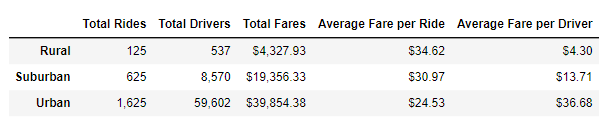
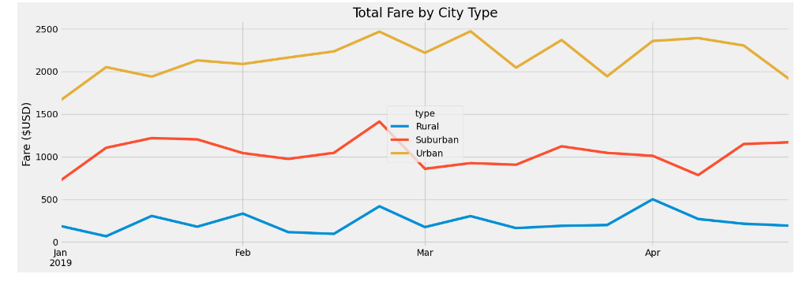

# PyBer_Analysis

## Project Overview
This Analysis of PyBer shows us multiple line graphs to calculate the total weekly fares for each city type. We used Pandas and Matplotlib
to get the results.

## Results
After processing the data we find that Urban Cities have the most Drivers and Fares. Rural Cities on Average are paying more for their fares per ride than either Urban or Suburban Cities, but the Drivers don't make as much on Average in Rural Cities.

After reviewing the total fares by city type from the first part of the year 2019, we find that the fare cost bounce around but peak at the end of February for Suburban and Rural cities and slowly increase again going into April. Urban stays pretty consistent through the first months of 2019 bouncing slightly in March with a peak in fares at the beginning of March.

## Summary
Conclusion: Based on the current results more drivers are needed in Urban and Suburban cities to accommodate the amount of fares in the higher populations. The opposite is needed in Rural cities where the fare is very low because we have too many drivers for the amount of fares. Relocation for rural drivers is a possible solution. 
